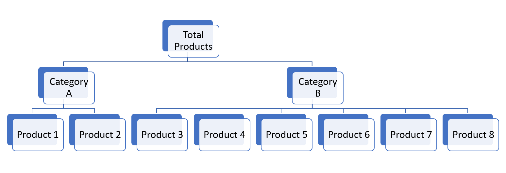

# Data Science Accelerator - Product Demand Forecast

## Introduction

Demand forecasting is the art and science of forecasting customer demand 
to drive holistic execution of such demand by corporate supply chain and 
business management. 

A manufactury company or retailer always want to predict the probable demand 
for products on the basis of the past events and prevailing trends in the present. 
This will help them make smarter strategy in production planning, inventory management, 
and at times in assessing future capacity requirements.
 
This repository contains three folders:

- **Data** This contains random artificial sample data with which we
  can demonstrate the process.
  
- **Code** This contains the R code and modelling process using R
  markdown files which can be converted to various formats, including
  pdf, html, ipynb, etc.
  
- **Docs** This contains miscellaneous documents including a blog post
    and installation instructions.

## Business domain

Manufacturing or Retail, product demand forecasting.

## Data science problem

Product demand forecast is categorized as a time series forecast problem: 
given the historical product booking/sales quantity, the task is to predict 
what is the product booking quantity in the near future. Given this knowledge 
management can make decisions to improve their production planning or
inventory management.

## Data understanding

In product demand forecasting, two types of data are
normally taken into consideration.

1. **Product quantity** Product quantity data contains quarterly/monthly
  booking quantity for multiple products during a time period in the past.

2. **Product category** Product category data contains two variables, product and category, 
  showing which category the product belongs to.

Such time series demand data can often be disaggregated by attributes of interest to 
form groups of time series or a hierarchy. In this example, we might be interested in 
forecasting demand of all products in total, by category and by individual.

## Modeling

[Forecasting hierarchical time series](https://www.otexts.org/fpp/9/4) is challenging 
because the generated forecasts need to satisfy the aggregate requirement, that is, 
lower-level forecasts need to sum up to the higher-level forecasts. 

There are many approaches that solve this problem, differing in the way they aggregate individual time series forecasts 
across the groups or the hierarchy: bottom-up, top-down, or middle-out.

Here, we use time series cross validation to choose the optimal aggregation method and base forecasting model and then do the final forecasting. 

Parallel computing is used to speed up the parameter tuning and time series cross validation.

 