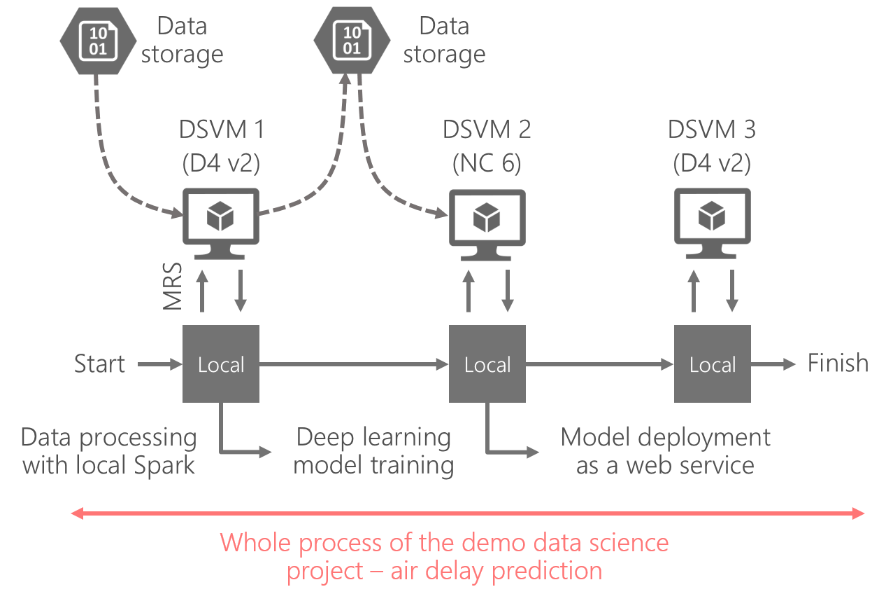

# Data Science Accelerator - *Operationalizing heterogeneous DSVM set for elastic data science on cloud.*

## Overview

This repo presents a example of operationalization on hetergeneous DSVM set for elastic data science on Azure cloud. 

The repository contains three parts

- **Data** Sample of air delay data is used. 
- **Code** An R markdown where step-by-step guide-line is provided as tutorial. Code scripts that will be executed remotely on DSVMs are placed under the sub-directories. 
- **Docs** Blog and presentation decks about this work will be added soon. 

## Business domain

The accelerator presents a walk-through on how to operationalize an end-to-end predictive analysis on air delay data with a heterogeneous set of Azure DSVMs. Modelling and feature engineering for this part are merely for illustration purpose, meaning that there is no fine-tune performed to achieve an optimal performance. 

## Data science problem

The problem is to predict air delay given features such as *day of month*, *day of week*, *origin of flight*, etc.

## Data understanding

The data set used in this accelerator is a sub set (10%) of the well-known air delay data set. The original data set can be obtained [here](https://packages.revolutionanalytics.com/datasets/).

## Modeling

For illustration purpose, a deep learning neural network is trained with and without GPU acceleration, *merely to compare the difference in training time*. While the focus is not primarily on model performance, readers can easily fine tune parameters or adjust network topology on their own. 

## Solution architecture

The overall architecture of the accelerator is depicted as follows.

A heterogeneous set of DSVMs for different tasks in a data science project, i.e., experimentation with a standalone-mode Spark, GPU-accelerated deep neural network training, and model deployment via web services, respectively. The benefits of doing this is that each provisioned DSVM will suit the specific task of each project sub-task, and stay alive only when it is needed. 

Detailed information for each of the machines is listed as follows.

|DSVM name|DSVM Size|OS|Description|Price|
|---------|--------------------|--------|-----------------------|--------|
|spark|Standard F16 - 16 cores and 32 GB memory|Linux|Standalone mode Spark for data preprocessing and feature engineering.|$0.796/hr|
|deeplearning|Standard NC6 - 6 cores, 56 GB memory, and Tesla K80 GPU|Windows|Train deep neural network model with GPU acceleration.|$0.9/hr|
|webserver|Standard D4 v2 - 8 cores and 28 GB memory|Linux|Deployed as a server where MRS service is published and run on.|$0.585/hr|

Data storage is used for temporarily preserving processed data, and it can also be seamlessly connected to DSVMs and administrated within R session by using AzureSMR package.  